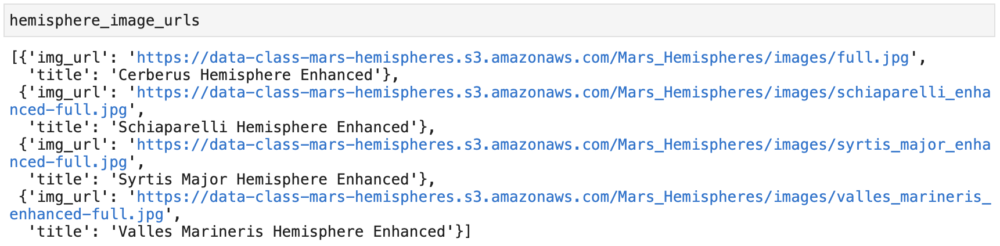
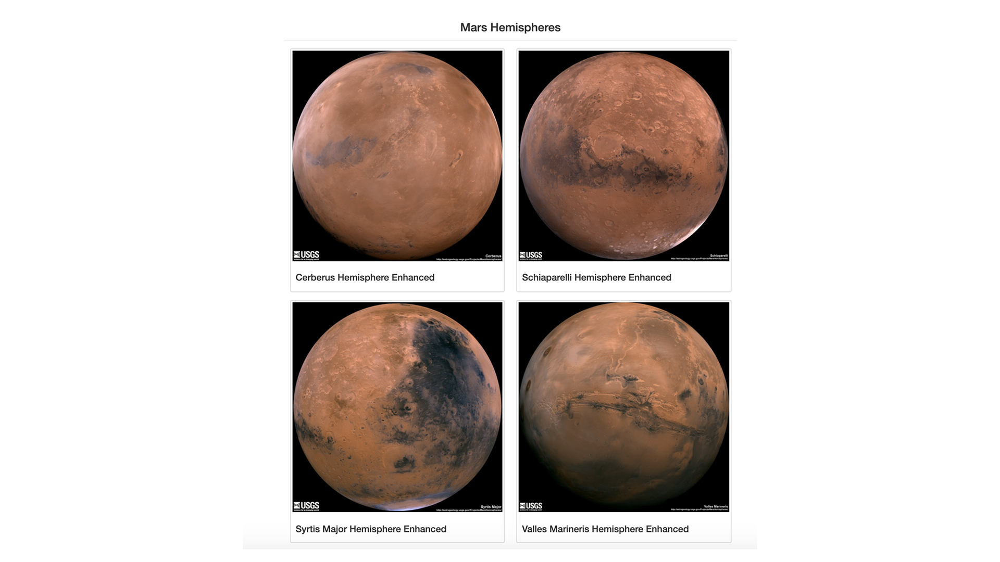
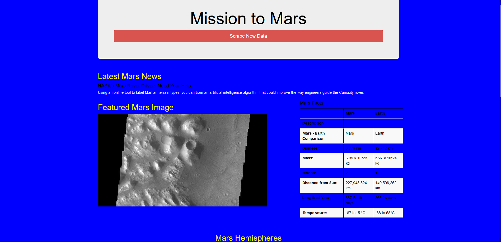

# Mission-To-Mars

### Overview of the Analysis

The purpose of this analysis was to:

1. Scrape full-resolution images of Mar's hemispheres
2. Scrape the titles of those images.
3. Store the scraped data in a Mongo database.
4. Display and alter the web app.

### Results

1. We were able to scrape the data and record the image urls and titles in a dictionary.

2. We were able to update the webpage and display the hemisphere images and titles.

3. We were able to update the webpage by adding Bootstrap 3 components:
    1. Making the webpage mobile responsive.
    2. Updating the button on the webpage.
    3. Updating the color scheme of the webpage.

